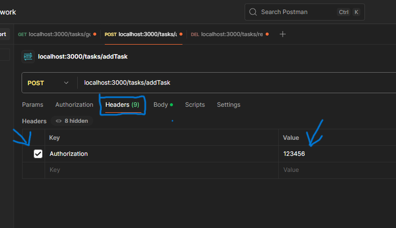

# ToDo Application 📄💡

## Requisitos 🪛

* Node.js
* Git (opcional pero recomendado)
* Visual Studio Code (opcional pero recomendado)

## Instrucciones

1. Clonar el repositorio con Git:
   
   ```bash
   git clone https://github.com/EzeAGB/ToDoApp.git
   ```

## Instrucciones para ejecutar el frontend ▶️

1. Entrar a la carpeta del frontend. Ej.:
   
   ```bash
   cd ./frontend
   ```

2. Configurar el proyecto con _npm_ :
   
   ```bash
   npm i
   -o-
   npm install
   ```

3. Ejecutar el proyecto con:
   
   ```bash
   npm start
   ```

## Intrucciones para ejecutar el backend ▶️

1. Entrar a la carpeta del backend. Ej.:
   
   ```bash
   cd ./backend
   ```

2. Configurar el proyecto con _npm_ :
   
   ```bash
   npm i
   -o-
   npm install
   ```

3. Ejecutar el proyecto con:
   
   ```bash
   npm start
   ```

## Desarrollo 🏗️

La API key por defecto es:

```bash
123456
```

Esta debe ser utilizada, por medio del header, en cada petición al backend. La llave del valor tiene que ser: "Authorization".

Ejemplo con Postman:


